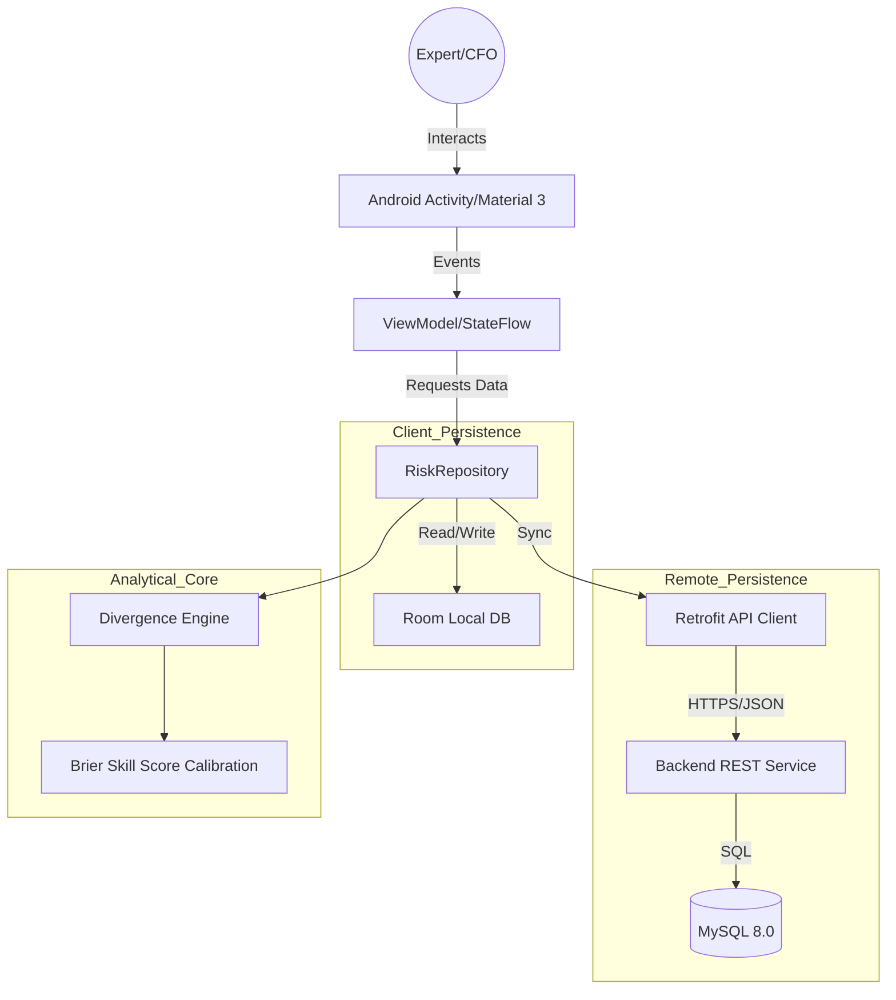
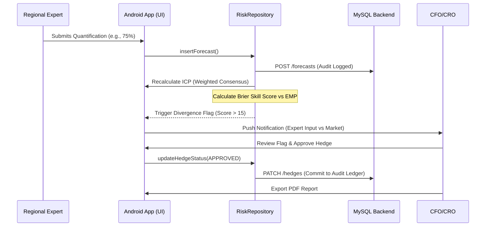

# Northbridge Analytics: Governed Decision Pipeline

[](https://www.gnu.org/licenses/agpl-3.0)
[](https://developer.android.com)
[](https://kotlinlang.org)

Northbridge Analytics is an enterprise-grade decision-support ecosystem designed to bridge the gap between internal expert judgment and external market data. By capturing, quantifying, and benchmarking private internal forecasts against real-time prediction markets and financial data, Northbridge provides CFOs and Risk Officers with a structured, auditable pipeline for high-stakes decision-making.

---

## 🏛 Business Context

### The Problem
Large organizations suffer from **scattering internal judgment**: valuable insights from regional experts regarding tariffs, regulations, and supply chain disruptions often live in Slack messages, emails, or "gut feelings." This judgment is rarely quantified, benchmarked against external market reality, or connected to auditable financial action (hedging) until it is too late to mitigate exposure.

### Objectives
*   **Centralization**: Transform qualitative regional expertise into quantified data assets.
*   **Benchmarking**: Continuously compare internal belief systems (ICP) against external market probabilities (EMP).
*   **Governance**: Create an immutable audit trail from the moment of quantification to the execution of a risk hedge.
*   **Calibration**: Measure and improve expert accuracy over time using Brier Skill Scores (BSS).

### Target Users & Personas
*   **Chief Financial Officer (CFO)**: Approves exposure mitigation strategies based on quantified evidence.
*   **Chief Risk Officer (CRO)**: Identifies organizational blind spots and monitors governance compliance.
*   **Regional Experts (Forecasters)**: Provide high-fidelity probability estimates on specific geopolitical or regulatory events.

---

## 📑 Table of Contents
1.  [Key Features & Business Value](#-key-features--business-value)
2.  [Technology Stack](#-technology-stack)
3.  [Architecture](#-architecture)
4.  [Project Structure](#-project-structure)
5.  [Environment Configuration](#-environment-configuration)
6.  [Local Development Setup](#-local-development-setup)
7.  [Testing & Quality Assurance](#-testing--quality-assurance)
8.  [Deployment & CI/CD](#-deployment--cicd)
9.  [Security & Privacy](#-security--privacy)
10. [Troubleshooting & FAQ](#-troubleshooting--faq)
11. [Contribution Guidelines](#-contribution-guidelines)
12. [License](#-license)

---

## 🚀 Key Features & Business Value

| Feature | Description | Business Value |
| :--- | :--- | :--- |
| **Divergence Engine 2.0** | Real-time comparison of Internal (ICP) vs. External (EMP) probabilities. | Early detection of blind spots before they impact the P&L. |
| **Reputation Weighting** | Brier Score-based calibration of expert contributions. | Prioritizes accurate judgment over organizational politics. |
| **Governed Hedge Workflow** | Multi-stage approval/execution for risk mitigation. | Fast-tracked, auditable exposure reduction with ledger commits. |
| **Executive Summary (BSS)** | Automated "Value Protected" metrics and Brier Skill Score reporting. | Streamlines Board Risk Committee preparation with "Expert Alpha" metrics. |
| **PDF Reporting** | High-fidelity bitmap capture and wireless printing of committee reports. | Ensures physical, immutable records for regulatory archival. |

---

## 🛠 Technology Stack

### Frontend (Android Mobile)
*    **Kotlin**: Primary language for robust, type-safe mobile logic.
*    **Material 3**: Modern, professional UI/UX using the Material 3 design system.
*    **MVVM + StateFlow**: Reactive, lifecycle-aware data streams using Coroutines and Flows.
*    **MPAndroidChart**: High-performance divergence trend and convergence visualization.

### Data & Infrastructure
*    **Room Persistence**: Offline-first local data storage with SQLite mapping.
*    **Retrofit + GSON**: Type-safe REST client for bi-directional synchronization with MySQL.
*    **KSP (Kotlin Symbol Processing)**: Efficient annotation processing for Room and Retrofit DTOs.

### Backend & Caching
*   **MySQL 8.0**: Centralized relational database acting as the "Global Ledger" for cross-client governance.
*   **RESTful API**: Middle-tier service for token-based authentication and database synchronization.

---

## 📐 Architecture

### High-Level System Architecture

**Description**: The system follows a Clean Architecture approach with a heavy emphasis on the **Repository Pattern**. The `RiskRepository` acts as the single source of truth, managing the complex synchronization between the offline-first `Room` database and the remote `MySQL` ledger. The `Analytical Core` performs reputation-weighting calculations locally before syncing results back to the global state.

### Detailed Data Flow (Forecast to Hedge)

**Description**: This sequence demonstrates the "Quantification-to-Action" lifecycle. Every state change is processed through the `RiskRepository`, which ensures that local consensus is updated immediately while a persistent audit log is written to the remote MySQL database to satisfy governance requirements.

---

## 📂 Project Structure

```text
app/src/main/java/com/example/northbridge/
├── api/             # Retrofit interfaces and DTOs for MySQL schema mapping.
├── db/              # Room Database configuration.
│   ├── dao/         # Data Access Objects (SQL query definitions).
│   └── entity/      # Room Entities (Local mirror of MySQL tables).
├── model/           # Business logic enums, data classes, and SessionManager.
├── repository/      # RiskRepository: The central sync and analytical logic engine.
├── ui/              # Material 3 View components, Adapters, and custom UI elements.
│   ├── RiskAdapter  # Dynamic role-based signal visualization.
│   └── LogAdapter   # Timeline-based audit log rendering.
└── viewmodel/       # Reactive ViewModels (MVVM Pattern) managing StateFlows.
```

---

## ⚙️ Environment Configuration

Northbridge requires connection to a Northbridge-compliant Backend API. Duplicate `.env.example` as `.env` and configure accordingly.

**Example `.env.example`:**
```env
# --- API CONFIG ---
BASE_URL="https://api.northbridge.analytics/v1/"
SYNC_INTERVAL_MINUTES=15

# --- AUTH ---
AUTH_TOKEN_HEADER="Authorization"
FCM_SENDER_ID="your-fcm-id"

# --- DATABASE ---
LOCAL_DB_NAME="northbridge_secure.db"
ENCRYPTION_KEY="your-passphrase-here"
```

---

## 🛠 Local Development Setup

### Prerequisites
*   **Android Studio Ladybug** (or newer).
*   **JDK 17** (Ensure `JAVA_HOME` is set correctly).
*   **Android SDK 35** (Target and Compile SDK).
*   **MySQL 8.0** (If running a local development instance).

### Installation
1.  **Clone the repository**:
    ```bash
    git clone https://github.com/alfinohatta/northbridge.git
    ```
2.  **Initialize environment**:
    ```bash
    cp .env.example .env
    ```
3.  **Open project**: Open the project folder in Android Studio.
4.  **Gradle Sync**: Ensure all dependencies from `libs.versions.toml` are resolved.

### Build & Run
```bash
# Assemble Debug APK
./gradlew assembleDebug

# Run Unit Tests
./gradlew test

# Install on connected device
./gradlew installDebug
```

---

## 🔐 Security & Governance
*   **Audit Logging**: Every action (quantification, review, execution) is logged with a JSON metadata payload to the MySQL `audit_log` table.
*   **Role-Based Access (RBAC)**: CFO/CRO roles have exclusive access to `AuditLogActivity` and `ReportActivity`.
*   **Immutable Data**: Probability estimates are immutable once submitted to ensure the audit trail remains undefiled.
*   **Encryption**: Local SQLite database is encrypted (if configured) using SQLCipher via the Repository layer.

---

## 📈 Operational Best Practices
*   **Sync Monitoring**: Monitor the `AuditLogActivity` weekly to ensure no synchronization gaps between Android clients and the MySQL master.
*   **Reputation Maintenance**: Experts should be re-calibrated quarterly as events resolve to maintain the integrity of the weighted consensus.
*   **Hedge Verification**: Always verify "Ledger Commits" in the app against third-party bank/brokerage receipts before settlement.

---

## 🤝 Contribution Guidelines
We welcome contributions from enterprise risk professionals and developers.
1.  **Fork** the repository.
2.  Create a **Feature Branch** (`git checkout -b feature/AmazingFeature`).
3.  **Commit** your changes following [Conventional Commits](https://www.conventionalcommits.org/).
4.  **Push** to the branch and open a **Pull Request**.

---

## ⚖️ License
Distributed under the **GNU Affero General Public License v3.0 (AGPL-3.0)**. 

*Northbridge Analytics is explicitly designed for governed enterprise environments. Modifying and redistributing the "Divergence Engine" core logic requires the release of the derivative source code under the same license.*

---

## ❓ FAQ & Troubleshooting
*   **Q: Why is my divergence score not updating?**
    *   A: Ensure the `external_market_data` table has been refreshed. Scores require both ICP and EMP signals.
*   **Q: Is there a Dark Mode?**
    *   A: Yes, Northbridge supports full Material 3 Day/Night themes based on system settings.
*   **Q: How do I resolve an event?**
    *   A: Long-press any active signal in the dashboard (CRO/CFO roles only) to resolve the outcome.
